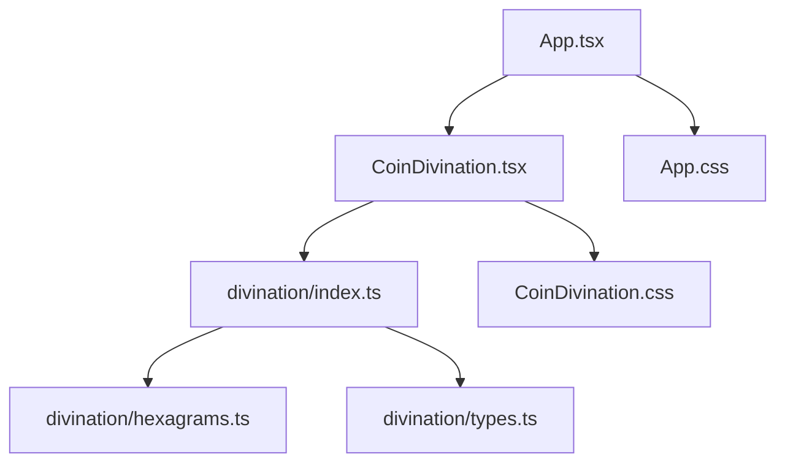

# I Ching Simulator Code Wiki

## Project Overview

The **I Ching Simulator** is a web application built with Vite + React (TypeScript) that simulates the traditional Chinese I Ching divination process using three coins. The application provides an interactive interface for users to ask questions, perform divination, and receive guidance based on the resulting hexagrams.

### Key Features

- Interactive coin toss animation
- Traditional I Ching divination logic
- Display of original and changed hexagrams
- Guidance for interpreting results based on changing lines
- AI integration capabilities for further interpretation
- Responsive design

## Project Architecture

The project follows a clean, modular architecture with clear separation of concerns:

```
web/
├── public/          # Static assets (favicon, icons)
├── src/
│   ├── assets/      # Images and other static resources
│   ├── components/  # React components
│   │   └── CoinDivination.tsx  # Core divination component
│   ├── divination/  # I Ching logic module
│   │   ├── index.ts      # Main divination functions
│   │   ├── hexagrams.ts  # Hexagram information
│   │   └── types.ts      # Type definitions
│   ├── App.tsx      # Main application component
│   ├── App.css      # Application styles
│   ├── main.tsx     # Application entry point
│   └── index.css    # Global styles
├── package.json     # Project dependencies and scripts
├── vite.config.ts   # Vite configuration
└── README.md        # Project documentation
```

## Core Modules

### 1. Main Application (App.tsx)

The main application component serves as the entry point for the user interface. It includes:

- Header with title and traditional I Ching principles
- Question input section for users to enter their query
- Integration of the CoinDivination component
- Footer with GitHub link and license information

**Key Functions:**
- `App()`: Main component function that renders the application layout
- State management for the user's question

### 2. Divination Component (CoinDivination.tsx)

The CoinDivination component is the core of the application, handling the entire divination process:

- Coin toss animation and visualization
- Step-by-step revelation of each yao (爻)
- Display of original and changed hexagrams
- Interpretation guidance based on changing lines

**Key Functions:**
- `CoinDivination({ question })`: Main component function
- `startDivination()`: Initiates the divination process
- `YaoRow({ line, visible, animating })`: Renders individual yao lines
- `HexagramCard({ label, lines, name, upper, lower })`: Displays hexagram information
- `getReadingGuidance(lines, originalName, changedName)`: Provides interpretation guidance

### 3. Divination Logic Module (divination/)

The divination module contains the core I Ching logic:

#### 3.1 Main Logic (index.ts)

**Key Functions:**
- `tossCoinsForYao(position)`: Simulates tossing three coins to generate a single yao
- `performDivination()`: Performs a complete divination by generating six yao lines
- `getHexagramInfo(lines)`: Retrieves hexagram information from binary representation

#### 3.2 Hexagram Information (hexagrams.ts)

**Key Functions:**
- `getHexagramInfo(lines)`: Maps binary爻线数组 to hexagram information

**Data Structures:**
- `TRIGRAM_NAMES`: Array of the eight basic trigram names
- `HEXAGRAM_NAMES`: 2D array mapping lower and upper trigrams to full hexagram names

#### 3.3 Type Definitions (types.ts)

**Key Types:**
- `YaoLine`: Interface for a single yao line result
- `HexagramResult`: Interface for a complete hexagram result

## Dependency Relationships



## Key Classes and Functions

### 1. App Component

**File:** [App.tsx](file:///workspace/web/src/App.tsx)

**Function:** `App()`
- **Purpose:** Main application component that renders the overall layout
- **Parameters:** None
- **Returns:** React JSX element
- **State:** `question` (string) - stores the user's question

### 2. CoinDivination Component

**File:** [CoinDivination.tsx](file:///workspace/web/src/components/CoinDivination.tsx)

**Function:** `CoinDivination({ question })`
- **Purpose:** Core divination component handling the entire divination process
- **Parameters:** `question` (string, optional) - user's question
- **Returns:** React JSX element
- **State:** 
  - `result` (HexagramResult | null) - divination result
  - `tossing` (boolean) - whether divination is in progress
  - `revealedCount` (number) - number of revealed yao lines
  - `tossCoins` (boolean[] | null) - current coin toss results
  - `coinFlying` (boolean) - whether coins are in animation
  - `coinLanded` (boolean) - whether coins have landed

**Function:** `startDivination()`
- **Purpose:** Initiates the divination process and manages the animation sequence
- **Parameters:** None
- **Returns:** None
- **Behavior:** Generates hexagram, displays coin toss animation, reveals yao lines one by one

**Function:** `getReadingGuidance(lines, originalName, changedName)`
- **Purpose:** Provides interpretation guidance based on the number of changing lines
- **Parameters:**
  - `lines` (YaoLine[]) - array of yao lines
  - `originalName` (string) - name of the original hexagram
  - `changedName` (string) - name of the changed hexagram
- **Returns:** string - guidance message

### 3. Divination Logic

**File:** [divination/index.ts](file:///workspace/web/src/divination/index.ts)

**Function:** `tossCoinsForYao(position)`
- **Purpose:** Simulates tossing three coins to generate a single yao
- **Parameters:** `position` (number) - which yao position (1-6)
- **Returns:** `YaoLine` - single yao line result
- **Logic:** Randomly generates coin flips, calculates sum, determines yin/yang and changing status

**Function:** `performDivination()`
- **Purpose:** Performs a complete divination by generating six yao lines
- **Parameters:** None
- **Returns:** `HexagramResult` - complete divination result
- **Logic:** Generates six yao lines, calculates original and changed hexagrams

**File:** [divination/hexagrams.ts](file:///workspace/web/src/divination/hexagrams.ts)

**Function:** `getHexagramInfo(lines)`
- **Purpose:** Maps binary爻线数组 to hexagram information
- **Parameters:** `lines` (boolean[]) - array of 6 booleans representing yin/yang
- **Returns:** `HexagramInfo` - hexagram information including name and trigrams
- **Logic:** Calculates lower and upper trigram indices, looks up names from tables

## Data Structures

### 1. YaoLine Interface

**File:** [divination/types.ts](file:///workspace/web/src/divination/types.ts)

```typescript
interface YaoLine {
  position: number;          // 1-6, bottom to top
  coins: [boolean, boolean, boolean];  // true=heads, false=tails
  value: 6 | 7 | 8 | 9;      // sum of coins
  type: 'yang' | 'yin';      // yin/yang type
  changing: boolean;          // whether this is a changing line
}
```

### 2. HexagramResult Interface

**File:** [divination/types.ts](file:///workspace/web/src/divination/types.ts)

```typescript
interface HexagramResult {
  lines: YaoLine[];           // six yao lines
  hexagramIndex: number;      // original hexagram number (1-64)
  changedHexagramIndex: number;  // changed hexagram number
  timestamp: number;          // timestamp of divination
}
```

### 3. HexagramInfo Interface

**File:** [divination/hexagrams.ts](file:///workspace/web/src/divination/hexagrams.ts)

```typescript
interface HexagramInfo {
  index: number;              // hexagram number (1-64)
  name: string;               // hexagram name
  lowerTrigram: string;       // lower trigram name
  upperTrigram: string;       // upper trigram name
}
```

## Running the Project

### Prerequisites

- Node.js (v14+)
- npm

### Installation

```bash
# Navigate to web directory
cd web

# Install dependencies
npm install
```

### Development Server

```bash
# Start development server with hot reloading
npm run dev
```

The application will be available at `http://localhost:5173/iching-simulator/`

### Build for Production

```bash
# Build for production
npm run build

# Preview production build locally
npm run preview
```

Build artifacts will be output to `web/dist/`

### Deployment to GitHub Pages

```bash
# Build and deploy to GitHub Pages
npm run build
npm run deployment
```

The application will be available at `https://[username].github.io/iching-simulator/`

## AI Integration

The project supports two methods for AI integration:

### 1. Browser Direct Connection (Offline Mode)

- Enter API Key, Base URL, and Model in the frontend settings
- Click "Connection Test" to verify
- Suitable for APIs that support CORS

### 2. Local Proxy (Recommended)

- Run the proxy server from the `proxy/` directory
- Configure API credentials in `.env` file
- Frontend automatically detects and uses proxy mode

```bash
# Start proxy server
cd proxy
cp .env.example .env
# Edit .env with your API credentials
npm install
npm start
```

## Technical Notes

### Coin Toss Logic

The application uses the traditional three-coin method:
- Heads (字) = 3 points
- Tails (花) = 2 points
- Sum = 6 → Old Yin (changing)
- Sum = 7 → Young Yang
- Sum = 8 → Young Yin
- Sum = 9 → Old Yang (changing)

### Hexagram Calculation

- Hexagrams are calculated using a 6-bit binary representation
- Bit 0 = bottom yao, Bit 5 = top yao
- Lower trigram = bits 0-2
- Upper trigram = bits 3-5
- Hexagram number = (lower trigram index × 8) + upper trigram index + 1

### Animation

- Coin toss animation uses CSS transitions and keyframes
- Each coin has a flying and landing animation
- Yao lines are revealed one by one with animation

## Browser Compatibility

- Modern browsers (Chrome, Firefox, Safari, Edge)
- Requires JavaScript enabled
- Responsive design works on desktop and mobile devices

## License

MIT License

## GitHub Repository

[https://github.com/Wozhizxy/iching-simulator](https://github.com/Wozhizxy/iching-simulator)